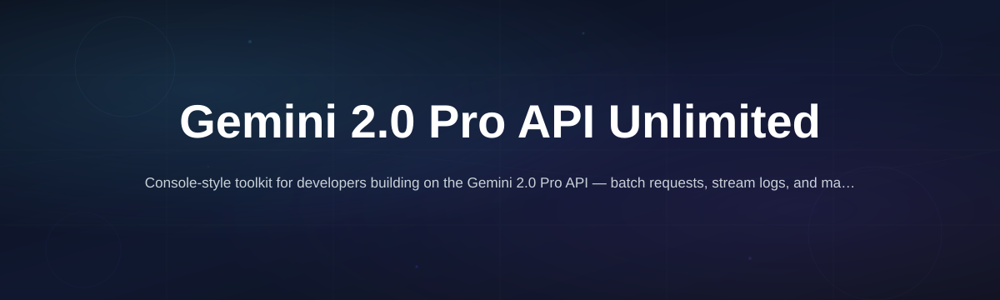
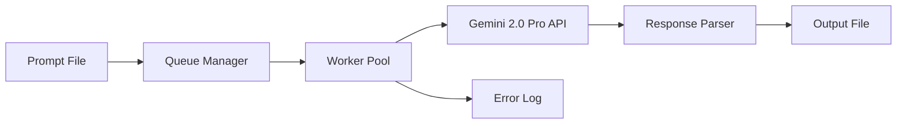

# gemini-pro-api-console

  

*The missing desktop console for teams who need sustained Gemini 2.0 Pro API throughput without babysitting a browser tab or juggling half-broken scripts.*

## What this is

The **Gemini 2.0 Pro API Unlimited Tool** exists because Google's own AI Studio and raw REST endpoints are not built for continuous, high-volume work. You end up copy-pasting prompts, managing context windows manually, and hitting rate walls exactly when a batch job needs to finish. This desktop console wraps the Gemini 2.0 Pro API in a native Windows application that keeps a persistent session running, queues requests intelligently, and writes results straight to disk — no browser, no cURL gymnastics.

This is not a wrapper for a third-party service and it does not hide a web UI behind a desktop shell. It is a standalone API client that talks directly to the Gemini 2.0 Pro endpoint using your own key, but removes the friction of building the request pipeline yourself. The tool handles asynchronous request scheduling, automatic retry with exponential backoff, and token budget tracking so you can run a 10,000-item generation job overnight and find the results organized in a folder in the morning.

## Who it is for

1. **Data teams** preparing training corpora — need to generate or rewrite thousands of examples with a consistent model version.
2. **QA engineers** who write test case variations and edge-case prompts in bulk, then need the outputs in a parseable format.
3. **Content operations managers** coordinating multi-stage editing workflows where the same API key is used by several people on a shared machine.
4. **Solo developers** building a prototype that talks to Gemini but who are tired of writing their own rate-limiter and retry logic.
5. **Researchers** doing qualitative coding or annotation tasks with long prompts and large context windows, who want a stable session that won't time out.

## What you can do

- **Manage a persistent request queue** — paste in a CSV or JSONL of prompts, set the concurrency level, and let the console grind through them sequentially or in parallel batches.
- **Monitor token consumption live** — every request shows input/output token counts against your model's context limit, with a running total for the session so you never get a surprise overage bill.
- **Retry failed requests automatically** — transient network errors and 429 rate-limit responses are caught, and the request is resent with backoff up to a configurable max retry count.
- **Save structured output** — responses are written as JSONL, CSV, or plain text files with a filename pattern you define (e.g., `output__batch1.jsonl`).
- **Inspect the full request/response cycle** — a debug panel shows the exact headers and payload sent to the Gemini 2.0 Pro API for any selected request, which is invaluable when something odd comes back.
- **Use a template prompt library** — store your system instructions and common user prompt skeletons locally, then variable-substitute from a spreadsheet column.
- **Export the session log** — a complete transaction history with timestamps, status codes, and latency is kept for auditing or for building your own analytics.

## Getting started

1. Head to the [landing page](https://mudparakeetreckon.github.io/gemini-pro-api-console/) and download the latest `gemini-pro-api-console-setup.exe`.
2. Run the installer — it does not require administrative rights and installs to your user folder by default.
3. Launch the app and paste your Gemini API key into the settings panel. The key is stored in Windows Credential Manager, not in plain text on disk.
4. Build your first request by loading a prompt template, or just type one in the composer.
5. Hit **Run Queue** to start a batch, or **Send Single** to test one call. The results panel will populate and the output file is written automatically.

## Requirements

- Windows 10 or Windows 11 (64-bit)
- No installation of Python, Node, or any runtime — the console is a self-contained executable
- An active Gemini API key from Google AI Studio (the tool does not provide a key)
- Internet connection for API calls; the app only talks to `generativelanguage.googleapis.com`

## How it works

The console separates the API interaction from the desktop UI, so the request pipeline runs in a background thread and never freezes the interface.

1. **Request ingestion** — prompts are read from a pasted block of text, a CSV file, or a folder of `.txt` files.
2. **Queue scheduling** — a worker pool picks up queued items respecting a minimum delay between each call.
3. **API transmission** — the worker constructs the payload for the Gemini 2.0 Pro model, sends it, and waits for the full response (streaming is not supported in this release).
4. **Result handling** — successful responses are parsed and written to your output folder; failed requests go to an error log but stay in the queue for manual retry.

## FAQ

**Is "Unlimited" literal? Does this bypass Google's rate limits for Gemini 2.0 Pro?**
No. You are still bound by the rate limits and quota assigned to your API key and billing account. The "unlimited" in the name refers to the tool's lack of artificial caps on queue length or batch size — unlike some web interfaces that throttle you after a few hundred requests within a single browser session. The console will run as long as the API accepts your requests.

**How is this different from using the `google-genai` SDK in a custom script?**
You skip the coding and testing phase entirely. The console provides a visual interface for queueing, a built-in retry handler with backoff, token accounting, and a way to inspect requests and responses without adding `print()` debug statements. If you are comfortable writing that logic yourself and maintaining it, a script might work. If you want to start generating in five minutes, this is faster.

**Can I use this with a team on a shared computer?**
Yes, but the current version supports one API key per installation. If multiple people need different keys, run separate instances with separate configuration profiles. The output files are written to the user's Documents folder under a `GeminiOutputs` directory by default to avoid permission conflicts.

**Does this tool stream responses like the web chat interface?**
No. The Gemini 2.0 Pro API used here returns the complete response after processing. This is a batch-oriented tool, not a real-time chat client. For a single prompt you will wait the full generation time before seeing the result.

**Is my prompt text ever sent to a server other than Google's?**
Correct — the only outbound network call is to the Gemini API endpoint. The console does not phone home, does not check for updates through a custom server (updates are manual), and does not report usage statistics anywhere.

## Troubleshooting

**Issue: A batch job stops silently. The queue shows pending items but no new requests are sent.**
Check the error log tab. The most common cause is hitting the per-minute request quota for your API key. The tool waits for the retry window, but if the delay exceeds your configured max retry count, it marks the item as failed. Lower the concurrency setting in the queue options and check your Google Cloud quota.

**Issue: The response is truncated or seems to be cut off mid-sentence.**
Look at the token usage numbers for that request. If the output tokens hit the model's maximum, you have hit the generation limit. Adjust your prompt to request shorter answers, or increase the `max_output_tokens` parameter in the settings panel for that specific request type.

**Issue: The app says "API key invalid" but the key works in AI Studio.**
The key may have a leading or trailing space that was copied with it. Go to the settings panel, delete the key, and paste it again ensuring no extra whitespace. Also verify the key is not for a different Google Cloud project than the one with the Gemini API enabled.

**Issue: Output file is empty even though the queue shows "Completed".**
Check the output folder path in the settings. If you changed the default location to a directory that requires admin rights (like `C:\Program Files`), the write will fail silently. Set the output folder to a user-writable path like `C:\Users\YourName\Downloads`.

## License

MIT License — see the [MIT License](LICENSE) file for details. This project is not affiliated with or endorsed by Google. It is a third-party desktop client for the Gemini API. You are responsible for complying with Google's terms of service for API usage, including any rate limits and billing obligations.

  

